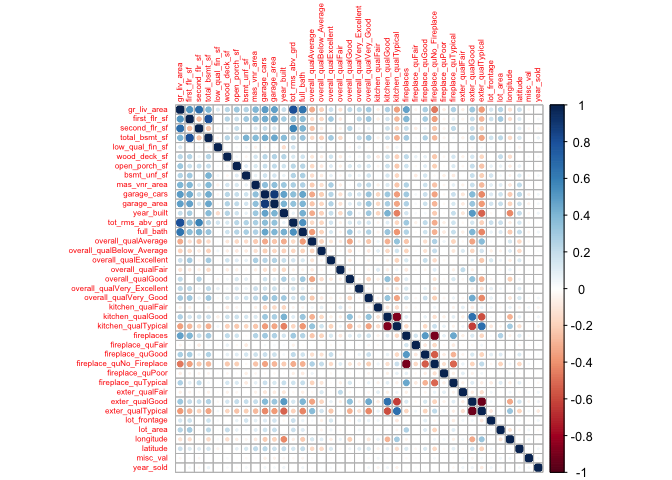

Data Science II HW 1
================
Maya Krishnamoorthy
2025-02-22

Read and prep CSV files.

``` r
train_df = read_csv("housing_training.csv") %>% janitor::clean_names()
```

    ## Rows: 1440 Columns: 26
    ## ── Column specification ────────────────────────────────────────────────────────
    ## Delimiter: ","
    ## chr  (4): Overall_Qual, Kitchen_Qual, Fireplace_Qu, Exter_Qual
    ## dbl (22): Gr_Liv_Area, First_Flr_SF, Second_Flr_SF, Total_Bsmt_SF, Low_Qual_...
    ## 
    ## ℹ Use `spec()` to retrieve the full column specification for this data.
    ## ℹ Specify the column types or set `show_col_types = FALSE` to quiet this message.

``` r
test_df = read_csv("housing_test.csv") %>% janitor::clean_names()
```

    ## Rows: 959 Columns: 26
    ## ── Column specification ────────────────────────────────────────────────────────
    ## Delimiter: ","
    ## chr  (4): Overall_Qual, Kitchen_Qual, Fireplace_Qu, Exter_Qual
    ## dbl (22): Gr_Liv_Area, First_Flr_SF, Second_Flr_SF, Total_Bsmt_SF, Low_Qual_...
    ## 
    ## ℹ Use `spec()` to retrieve the full column specification for this data.
    ## ℹ Specify the column types or set `show_col_types = FALSE` to quiet this message.

Response variable: `sale_price`

## Part a)

**Fit a lasso model on the training data. Report the selected tuning
parameter and the test error. When the 1SE rule is applied, how many
predictors are included in the model?**

### Minimizing CV error

``` r
# Using glmnet
ctrl1 = trainControl(method = "repeatedcv",
                     number = 10,
                     repeats = 5,
                     selectionFunction = "best")

set.seed(2025)
lasso.fit =
  train(sale_price ~ .,
        data = train_df,
        method = "glmnet",
        tuneGrid = expand.grid(alpha = 1, lambda = exp(seq(6, 0, length = 100))),
        trControl = ctrl1)

plot(lasso.fit, xTrans = log)
```

<!-- -->

``` r
lasso.fit$bestTune
```

    ##    alpha  lambda
    ## 69     1 61.6339

``` r
# coefficients in the final model
coef(lasso.fit$finalModel, lasso.fit$bestTune$lambda)
```

    ## 40 x 1 sparse Matrix of class "dgCMatrix"
    ##                                       s1
    ## (Intercept)                -4.836395e+06
    ## gr_liv_area                 6.543755e+01
    ## first_flr_sf                7.999642e-01
    ## second_flr_sf               .           
    ## total_bsmt_sf               3.540696e+01
    ## low_qual_fin_sf            -4.099739e+01
    ## wood_deck_sf                1.165602e+01
    ## open_porch_sf               1.547641e+01
    ## bsmt_unf_sf                -2.088888e+01
    ## mas_vnr_area                1.087575e+01
    ## garage_cars                 4.091188e+03
    ## garage_area                 8.148299e+00
    ## year_built                  3.234411e+02
    ## tot_rms_abv_grd            -3.629012e+03
    ## full_bath                  -3.867530e+03
    ## overall_qualAverage        -4.863474e+03
    ## overall_qualBelow_Average  -1.247712e+04
    ## overall_qualExcellent       7.536386e+04
    ## overall_qualFair           -1.077495e+04
    ## overall_qualGood            1.213092e+04
    ## overall_qualVery_Excellent  1.354555e+05
    ## overall_qualVery_Good       3.789907e+04
    ## kitchen_qualFair           -2.493652e+04
    ## kitchen_qualGood           -1.728827e+04
    ## kitchen_qualTypical        -2.539112e+04
    ## fireplaces                  1.058861e+04
    ## fireplace_quFair           -7.677808e+03
    ## fireplace_quGood            .           
    ## fireplace_quNo_Fireplace    1.511070e+03
    ## fireplace_quPoor           -5.651580e+03
    ## fireplace_quTypical        -7.012976e+03
    ## exter_qualFair             -3.356377e+04
    ## exter_qualGood             -1.530384e+04
    ## exter_qualTypical          -1.973755e+04
    ## lot_frontage                9.979682e+01
    ## lot_area                    6.043028e-01
    ## longitude                  -3.303322e+04
    ## latitude                    5.529084e+04
    ## misc_val                    8.333497e-01
    ## year_sold                  -5.648620e+02

``` r
# test error
predictions = predict(lasso.fit, newdata = test_df)
mse = mean((predictions - pull(test_df, "sale_price"))^2)
```

The tuning parameter that minimizes CV error is 61.6339. The MSE
associated with this model is 440335429.

### Minimizing for 1SE

``` r
ctrl2 = 
  trainControl(method = "repeatedcv",
               number = 10,
               repeats = 5,
               selectionFunction = "oneSE")

set.seed(2025)

lasso.fit_1se = 
  train(sale_price ~ .,
        data = train_df,
        method = "glmnet",
        tuneGrid = expand.grid(alpha = 1, lambda = exp(seq(6, 0, length = 100))),
        trControl = ctrl2)

# Best lambda for 1SE
lasso.fit_1se$bestTune
```

    ##     alpha   lambda
    ## 100     1 403.4288

``` r
# Getting number of predictors
coeff = coef(lasso.fit_1se$finalModel, lasso.fit_1se$bestTune$lambda)
length(which(coeff != 0)) - 1
```

    ## [1] 36

``` r
# MSE
predictions = predict(lasso.fit_1se, newdata = test_df)
mse = mean((predictions - pull(test_df, "sale_price"))^2); mse
```

    ## [1] 420726548

Using the 1SE rule, the optimal tuning parameter is 403.4288. The MSE is
420726548. There are 36 (non-zero) predictors in this model.

## Part b)

**Fit an elastic net model on the training data. Report the selected
tuning parameters and the test error. Is it possible to apply the 1SE
rule to select the tuning parameters for elastic net? If the 1SE rule is
applicable, implement it to select the tuning parameters. If not,
explain why.**

``` r
set.seed(2025)

enet.fit <- train(sale_price ~ .,
                  data = train_df,
                  method = "glmnet",
                  tuneGrid = expand.grid(alpha = seq(0, 1, length = 20), 
                                         lambda = exp(seq(10, 0, length = 100))),
                  trControl = ctrl1)
enet.fit$bestTune
```

    ##          alpha   lambda
    ## 164 0.05263158 580.3529

``` r
myCol <- rainbow(25)
myPar <- list(superpose.symbol = list(col = myCol),
              superpose.line = list(col = myCol))

plot(enet.fit, par.settings = myPar, xTrans = log)
```

<!-- -->

``` r
# coefficients in the final model
coef(enet.fit$finalModel, enet.fit$bestTune$lambda)
```

    ## 40 x 1 sparse Matrix of class "dgCMatrix"
    ##                                       s1
    ## (Intercept)                -5.113316e+06
    ## gr_liv_area                 3.888606e+01
    ## first_flr_sf                2.659339e+01
    ## second_flr_sf               2.534167e+01
    ## total_bsmt_sf               3.495196e+01
    ## low_qual_fin_sf            -1.596905e+01
    ## wood_deck_sf                1.231770e+01
    ## open_porch_sf               1.686371e+01
    ## bsmt_unf_sf                -2.072999e+01
    ## mas_vnr_area                1.165591e+01
    ## garage_cars                 4.046669e+03
    ## garage_area                 8.894532e+00
    ## year_built                  3.191010e+02
    ## tot_rms_abv_grd            -3.439303e+03
    ## full_bath                  -3.693423e+03
    ## overall_qualAverage        -5.113423e+03
    ## overall_qualBelow_Average  -1.269944e+04
    ## overall_qualExcellent       7.586249e+04
    ## overall_qualFair           -1.145724e+04
    ## overall_qualGood            1.197943e+04
    ## overall_qualVery_Excellent  1.364598e+05
    ## overall_qualVery_Good       3.765074e+04
    ## kitchen_qualFair           -2.367794e+04
    ## kitchen_qualGood           -1.610305e+04
    ## kitchen_qualTypical        -2.415426e+04
    ## fireplaces                  1.080415e+04
    ## fireplace_quFair           -7.895400e+03
    ## fireplace_quGood            1.050416e+02
    ## fireplace_quNo_Fireplace    1.745086e+03
    ## fireplace_quPoor           -5.840965e+03
    ## fireplace_quTypical        -7.003111e+03
    ## exter_qualFair             -3.285657e+04
    ## exter_qualGood             -1.445844e+04
    ## exter_qualTypical          -1.905526e+04
    ## lot_frontage                1.001013e+02
    ## lot_area                    6.031323e-01
    ## longitude                  -3.514521e+04
    ## latitude                    5.771438e+04
    ## misc_val                    8.665642e-01
    ## year_sold                  -5.730607e+02

``` r
# MSE
enet.pred = predict(enet.fit, newdata = test_df)
mean((enet.pred - pull(test_df, "sale_price"))^2)
```

    ## [1] 438502352

The optimal tuning parameters for the elastic net model are lambda =
580.3529 and alpha = 0.05263158. The test error is 438502352.

``` r
# Trying 1SE method
set.seed(2025)
enet.fit_1se <- train(sale_price ~ .,
                  data = train_df,
                  method = "glmnet",
                  tuneGrid = expand.grid(alpha = seq(0, 1, length = 20), 
                                         lambda = exp(seq(10, 0, length = 100))),
                  trControl = ctrl2)
enet.fit_1se$bestTune
```

    ##    alpha   lambda
    ## 88     0 6554.314

``` r
# MSE
enet.pred_1se = predict(enet.fit_1se, newdata = test_df)
mean((enet.pred_1se - pull(test_df, "sale_price"))^2)
```

    ## [1] 426591709

Using 1SE, the resulting tuning parameters are alpha = 0 and lambda =
6554.314. The resulting test error is 426591709. Since the test errors
are similar for both 1SE and CV methods, we can go ahead and use the 1SE
method as well. **CHECK THIS**

## Part c)

**Fit a partial least squares model on the training data and report the
test error. How many components are included in your model?**

``` r
set.seed(2025)

pls_fit = train(sale_price ~ .,
                data = train_df,
                method = "pls",
                tuneGrid = data.frame(ncomp = 1:(ncol(train_df)-1)),
                trControl = ctrl1,
                preProcess = c("center", "scale"))

pred.pls = predict(pls_fit, newdata = test_df)
mean((pred.pls - pull(test_df, "sale_price"))^2)
```

    ## [1] 449622718

``` r
ggplot(pls_fit, highlight = TRUE)
```

<!-- -->

The final model used 12 components.

## Part d)

**Choose the best model for predicting the response and explain your
choice.**

``` r
resamp = resamples(list(
  lasso = lasso.fit,
  lasso_1SE = lasso.fit_1se,
  elastic_net = enet.fit,
  elastic_net_1SE = enet.fit_1se,
  pls = pls_fit))

summary(resamp)
```

    ## 
    ## Call:
    ## summary.resamples(object = resamp)
    ## 
    ## Models: lasso, lasso_1SE, elastic_net, elastic_net_1SE, pls 
    ## Number of resamples: 50 
    ## 
    ## MAE 
    ##                     Min.  1st Qu.   Median     Mean  3rd Qu.     Max. NA's
    ## lasso           13537.09 15652.66 16706.03 16683.64 17460.55 20389.90    0
    ## lasso_1SE       13741.05 15488.04 16760.51 16675.72 17582.44 20329.70    0
    ## elastic_net     13538.68 15621.61 16685.48 16653.81 17464.58 20380.78    0
    ## elastic_net_1SE 13923.44 15537.41 16736.04 16665.25 17662.25 20403.12    0
    ## pls             13541.05 15705.61 16801.97 16743.35 17425.24 20449.02    0
    ## 
    ## RMSE 
    ##                     Min.  1st Qu.   Median     Mean  3rd Qu.     Max. NA's
    ## lasso           18494.38 21261.73 22627.67 22990.46 24204.20 28796.33    0
    ## lasso_1SE       18772.02 21086.26 22889.89 23248.40 24683.32 29471.25    0
    ## elastic_net     18510.31 21196.91 22596.01 22978.75 24164.42 28861.39    0
    ## elastic_net_1SE 18980.70 21253.63 22998.71 23305.37 24567.25 29916.65    0
    ## pls             18509.98 21294.47 22643.58 22987.04 24135.51 28679.31    0
    ## 
    ## Rsquared 
    ##                      Min.   1st Qu.    Median      Mean   3rd Qu.      Max.
    ## lasso           0.8630327 0.8935367 0.9037721 0.9027869 0.9126593 0.9360194
    ## lasso_1SE       0.8571894 0.8902468 0.9004985 0.9007136 0.9114975 0.9382990
    ## elastic_net     0.8624895 0.8934559 0.9033690 0.9029035 0.9131980 0.9367516
    ## elastic_net_1SE 0.8537071 0.8918571 0.8991045 0.9007256 0.9098063 0.9350768
    ## pls             0.8639320 0.8933068 0.9036110 0.9028056 0.9128070 0.9361768
    ##                 NA's
    ## lasso              0
    ## lasso_1SE          0
    ## elastic_net        0
    ## elastic_net_1SE    0
    ## pls                0

``` r
bwplot(resamp, metric = "RMSE")
```

<!-- -->
